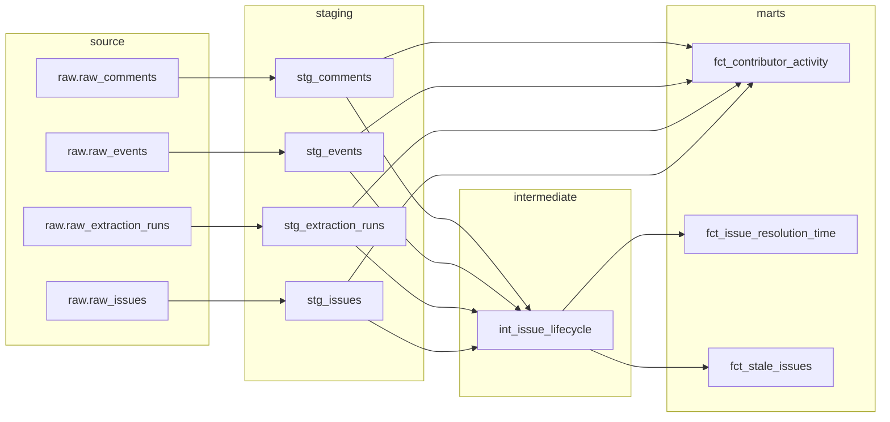

# dbt lineage

Generated by `make lineage` from `target/manifest.json`.

```mermaid
flowchart LR
  subgraph source["source"]
    raw_comments["raw.raw_comments"]
    raw_events["raw.raw_events"]
    raw_extraction_runs["raw.raw_extraction_runs"]
    raw_issues["raw.raw_issues"]
  end
  subgraph staging["staging"]
    stg_comments["stg_comments"]
    stg_events["stg_events"]
    stg_extraction_runs["stg_extraction_runs"]
    stg_issues["stg_issues"]
  end
  subgraph intermediate["intermediate"]
    int_issue_lifecycle["int_issue_lifecycle"]
  end
  subgraph marts["marts"]
    fct_contributor_activity["fct_contributor_activity"]
    fct_issue_resolution_time["fct_issue_resolution_time"]
    fct_stale_issues["fct_stale_issues"]
  end
  int_issue_lifecycle --> fct_issue_resolution_time
  int_issue_lifecycle --> fct_stale_issues
  stg_comments --> fct_contributor_activity
  stg_comments --> int_issue_lifecycle
  stg_events --> fct_contributor_activity
  stg_events --> int_issue_lifecycle
  stg_extraction_runs --> fct_contributor_activity
  stg_extraction_runs --> int_issue_lifecycle
  stg_issues --> fct_contributor_activity
  stg_issues --> int_issue_lifecycle
  raw_comments --> stg_comments
  raw_events --> stg_events
  raw_extraction_runs --> stg_extraction_runs
  raw_issues --> stg_issues
```
